# 🦙 llama-server-builder

> 自动从 [aetherbird/llama.cpp](https://github.com/aetherbird/llama.cpp/tree/bailingmoe3-support) 编译 **Ling-3.0-tiny** 推理服务器，专为 **RTX 50 系列（Blackwell）** 优化。

[](https://github.com/features/actions)
[](https://developer.nvidia.com/cuda-toolkit)
[](https://developer.nvidia.com/cuda-gpus)
[](LICENSE)

---

## 🏗️ 架构总览

```mermaid
flowchart LR
    A[🔗 aetherbird/llama.cpp<br/>bailingmoe3-support 分支] -->|每次运行自动拉取| B[⚙️ GitHub Actions<br/>windows-2022 Runner]
    
    subgraph Pipeline [🚀 CI/CD 流水线]
        direction TB
        B --> C[📦 安装 CUDA 12.8.1<br/>nvcc + cuBLAS + cuDART]
        C --> D[🔀 Checkout 最新源码<br/>submodules: recursive]
        D --> E[🛠️ 构建环境准备<br/>MSVC vcvars64 + 屏蔽 MinGW]
        E --> F[🔨 CMake + Ninja 编译<br/>sm_120 / Flash Attention]
        F --> G[📁 收集产物<br/>exe + 全部 dll]
        G --> H[🗜️ 打包为 zip<br/>llama-server-rtx50-cuda12.8-vX.X.X.zip]
        H --> I[🚢 发布到 Releases<br/>一键下载即用]
    end
    
    I --> J[💻 用户下载<br/>解压即用]
    J --> K[🤖 运行 Ling-3.0-tiny<br/>RTX 50 满血推理]
```



---

## 📋 系统要求

| 项目 | 最低要求 | 推荐配置 |
|------|---------|---------|
| **显卡** | RTX 5050 (8GB) | RTX 5070/5080/5090 |
| **显存** | 8 GB | 16 GB+ |
| **系统** | Windows 10/11 64-bit | Windows 11 24H2 |
| **驱动** | NVIDIA Driver ≥ 555.xx | 最新 Game Ready 驱动 |
| **内存** | 16 GB | 32 GB |
| **磁盘** | 2 GB 可用空间 | 5 GB SSD |

---

## 🚀 快速使用

### 方式一：GitHub Actions 自动编译（推荐）

1. 进入仓库的 **[Actions](../../actions)** 页面
2. 选择工作流 **"Build Ling-3.0-tiny Server for RTX 50 Series"**
3. 点击 **"Run workflow"** 按钮
4. 填写参数：
   - **tag_name**：版本号，如 `v1.0.0`
   - **cuda_version**：CUDA 版本，默认 `12.8.1`
5. 等待 **15~20 分钟**，编译完成后自动发布到 **[Releases](../../releases)**
6. 下载 `llama-server-rtx50-cuda12.8-v1.0.0.zip`，解压即用

### 方式二：本地运行

```powershell
# 1. 解压下载的 zip 包到纯英文目录（如 D:\llama-server\）
# 2. 将 Ling-3.0-tiny GGUF 模型放入同一目录
# 3. 在该目录打开 PowerShell，运行：

.\llama-server.exe -m "Ling-3.0-tiny-UD-Q8_K_XL.gguf" --jinja --host 0.0.0.0 --port 8080 -ngl 999 -t 16

# 4. 浏览器访问 http://localhost:8080 开始对话
# 5. 局域网其他设备访问 http://你的局域网IP:8080
```

#### 常用启动参数

| 参数 | 说明 | 示例 |
|------|------|------|
| `-m` | 模型文件路径 | `-m model.gguf` |
| `--host` | 监听地址（`0.0.0.0`=局域网可访问） | `--host 0.0.0.0` |
| `--port` | 服务端口 | `--port 8080` |
| `-ngl` | 加载到 GPU 的层数（`999`=全部） | `-ngl 999` |
| `-t` | CPU 线程数 | `-t 16` |
| `--jinja` | 启用 Jinja2 模板（Ling 必需） | `--jinja` |
| `--ctx-size` | 上下文长度 | `--ctx-size 8192` |
| `--threads-batch` | 批处理线程数 | `--threads-batch 8` |

---

## 📦 产物内容

每次编译成功后，Release 中包含以下文件：

| 文件 | 说明 | 必需 |
|------|------|:----:|
| `llama-server.exe` | 推理服务器主程序 | ✅ |
| `ggml-cuda.dll` | GGML CUDA 后端（动态加载） | ✅ |
| `llama-common.dll` | Llama 公共组件 | ✅ |
| `llama.dll` | Llama 模型核心库 | ✅ |
| `mtmd.dll` | 多模态支持（图片/音频） | ⚠️ |
| `cudart64_*.dll` | CUDA 运行库 | ✅ |
| `cublas64_*.dll` | CUDA BLAS 数学库 | ✅ |
| `cublasLt64_*.dll` | CUDA BLASLt 加速库 | ✅ |
| `vcruntime140*.dll` | VC++ 运行库（/MT 静态链接冗余备份） | ⚠️ |
| `msvcp140*.dll` | VC++ 标准库 | ⚠️ |
| `concrt140.dll` | 并发运行时 | ⚠️ |
| `llama-server-rtx50-cuda12.8-vX.X.X.zip` | 以上所有文件的打包压缩包 | ✅ |

> ✅ = 必需 &nbsp;&nbsp; ⚠️ = 已静态链接，可删除（删除后测试能正常运行即可）

---

## ⚙️ 编译参数详解

| 参数 | 值 | 作用 |
|------|----|------|
| `GGML_CUDA` | `ON` | 启用 CUDA 后端加速 |
| `CMAKE_CUDA_ARCHITECTURES` | `120` | **RTX 50 系 Blackwell 专属算力值** |
| `GGML_CUDA_FA_ALL_QUANTS` | `ON` | Flash Attention 全量化内核（MoE 必备） |
| `GGML_NATIVE` | `OFF` | 关闭 CPU 原生优化，保证跨机器通用性 |
| `GGML_BACKEND_DL` | `ON` | CUDA 后端动态加载，减小主程序体积 |
| `LLAMA_BUILD_SERVER` | `ON` | 编译 `llama-server` 服务端 |
| `LLAMA_BUILD_TOOLS` | `ON` | 编译配套工具（quantize 等） |
| `LLAMA_BUILD_BORINGSSL` | `OFF` | 使用系统 OpenSSL，避免许可证冲突 |
| `OPENSSL_USE_STATIC_LIBS` | `ON` | 静态链接 OpenSSL，用户无需额外安装 |
| `CMAKE_C_FLAGS` / `CMAKE_CXX_FLAGS` | `/MT` | 静态链接 VC++ 运行库，开箱即用 |

---

## 🎯 显存适配参考

| 显存 | 适用显卡 | 推荐量化 | 可跑模型规模 |
|------|---------|---------|------------|
| **8 GB** | RTX 5050 / 5060 | Q4_K_M / Q5_K_M | 7B ~ 14B |
| **16 GB** | RTX 5060Ti / 5070 / 5080 | Q8_0 / UD-Q8_K_XL | 14B ~ 32B |
| **24 GB** | RTX 5080 (24G) / 5090 | BF16 / F16 | 32B ~ 70B |
| **32 GB** | RTX 5090 | BF16 全精度 | 70B 以内 |

---

## 🔧 自定义编译

### 切换 CUDA 版本
在 Actions 页面运行工作流时，修改 `cuda_version` 输入框的值（如 `13.0`、`12.6` 等），无需修改代码。

### 修改 CMake 参数
编辑 `.github/workflows/build.yml` 中的 `CMake 配置` 步骤，添加/修改 `-D` 开头的参数，然后重新运行工作流。

### 关闭多模态支持（减小体积 ~5MB）
在 CMake 配置中添加：
```
-DLLAMA_BUILD_MTMD=OFF
```

### 精简 VC++ 运行库（减小体积 ~2MB）
删除 Release 中的以下文件（已通过 `/MT` 静态链接进 exe）：
```
vcruntime140.dll / vcruntime140_1.dll
msvcp140.dll / msvcp140_1.dll / msvcp140_2.dll
concrt140.dll
```

---

## 🐛 常见问题

### Q: 启动后报 `unknown model architecture: 'bailingmoe3'`？
**A:** 你用的是官方主线 llama.cpp 编译的 exe。Ling-3.0-tiny 是蚂蚁百灵的自定义 MoE 架构，**必须用本仓库工作流编译的 exe**（基于 `aetherbird/llama.cpp@bailingmoe3-support` 分支）。

### Q: 局域网其他设备连不上？
**A:** 检查两点：
1. 启动时是否加了 `--host 0.0.0.0` 参数
2. Windows 防火墙是否放行了端口（入站规则允许 `llama-server.exe`）

### Q: 显存不够怎么办？
**A:** 降低 `-ngl` 值（如 `-ngl 50`），让部分层在 CPU 内存中计算；或换用更低比特的量化模型（Q4_K_M / Q3_K_L）。

### Q: 每次运行都会重新安装 CUDA 吗？
**A:** 是的，每次 Runner 启动都是全新环境。安装 CUDA 约占用 3~5 分钟，这是正常开销。

---

## 📄 License

MIT License — 自由使用、修改和分发。

---

<div align="center">

**⭐ 如果这个项目对你有帮助，请给个 Star！**

Made with ❤️ for the Ling-3.0-tiny community

</div>
